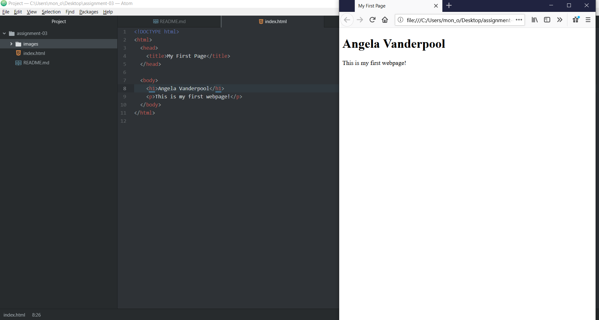

# Assignment 3
## Angela Vanderpool

1. When we type a request into a search engine, that request goes over the network to a server which responds with a collection of web content. The browser interprets the content that is returned and displays it as a webpage. The browser translates web languages to render the layout of webpages. I mainly use Mozilla Firefox for my web browser.

2. Markup is a language that dictates the architecture of the webpage with its main focus being the text content. HTML, which stands for *Hypertext Markup Language*, is the most widely used web language. It utilizes a standardized element and tagging system that renders content and page structure.

3. 
