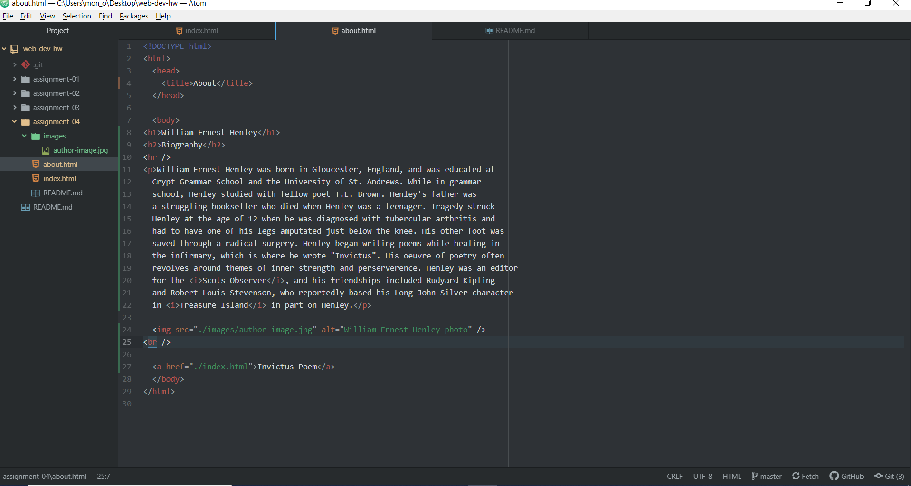

# Assignment 4
## Angela Vanderpool

1. On *The Wayback Machine*, I looked up Amazon.com in 2007. The design of the webpage seemed simpler back then; icons were smaller and the whole page was less animated than it is now. Links for different shopping departments were listed on the righthand side of the page instead of having a search bar with those options and a drop down menu at the top of the webpage as it is now. This was pre-Prime so that option wasn't available in 2007. The site was similar to what it is now in that both versions have icons advertising many different items on the homepage, but the layout of the photos are more magnified now, it seems.

2. I learned a lot with the GIT Module. I learned how web browsers function, why it is important to keep my browser up to date, how to use the GitHub pages option, how to render HTML pages, how to use GitHub desktop in conjunction with Atom, and how to push repo changes to GitHub.com instead of uploading through the website. It seems like working through the desktop is easier than uploading directly on the website. It is nice to have an easy way to make changes to the repo through desktop. There are a lot of steps overall with using GitHub, and I just hope that I took really good notes to help me going forward.

3. 
