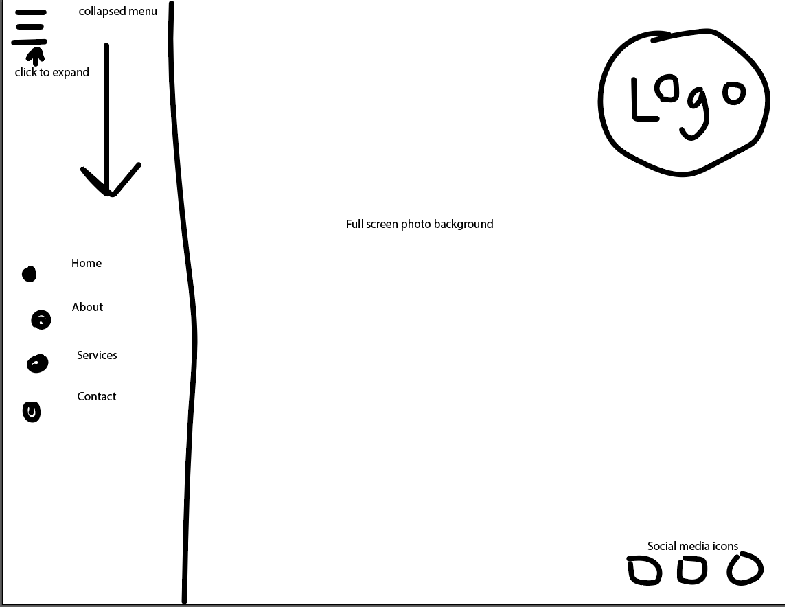

# Assignment 11
## Angela Vanderpool

1. *Padding* determines how much space there will be between the content of an element and its border. *Margin* controls the gap between boxes so you are able to apply space between them rather than having them right up against each other. *Borders* separate the edge of boxes from each other and may or may not be visible depending on the set specifications.

2. <!-- Insert image of sketch --> 

3. <!-- Work cycle summary --> I followed the work through video and made some minor adjustments with color and how I wanted the background image to appear. I wanted it to cover the full screen and my initial plan was to have the sidebar menu be collapsible. However, when I looked at w3schools.com, it looked like javascript had to be included in the code for a collapsible sidebar and since I have not done anything with java, it didn't look like this would be a possibility for me. I also wanted to add the logo button to the right hand side of the webpage since the menu bar was supposed to be collapsed. Without the collapsible sidebar, putting the logo where you placed it in the video seemed like the best option. Therefore, my sketch does not completely match the final product. Also, I don't know how you got your social media icons to be black and white. I would have preferred that but ended up having to keep the colors of the svg icons I found online.
